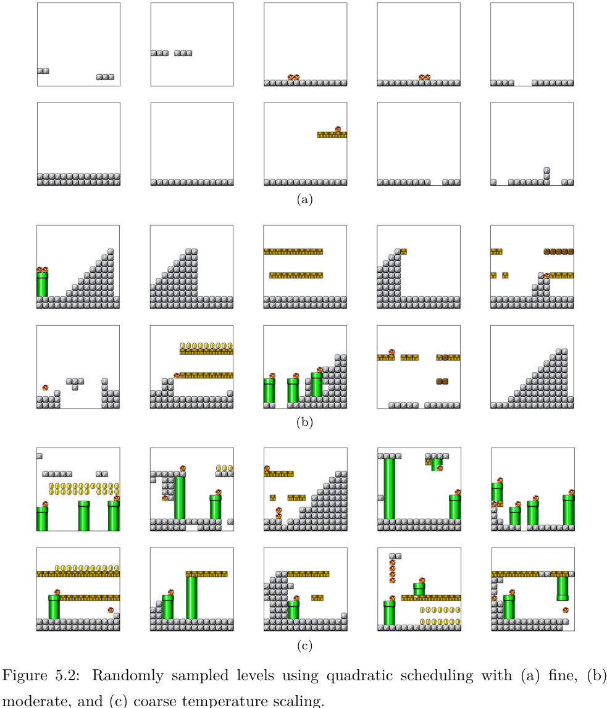
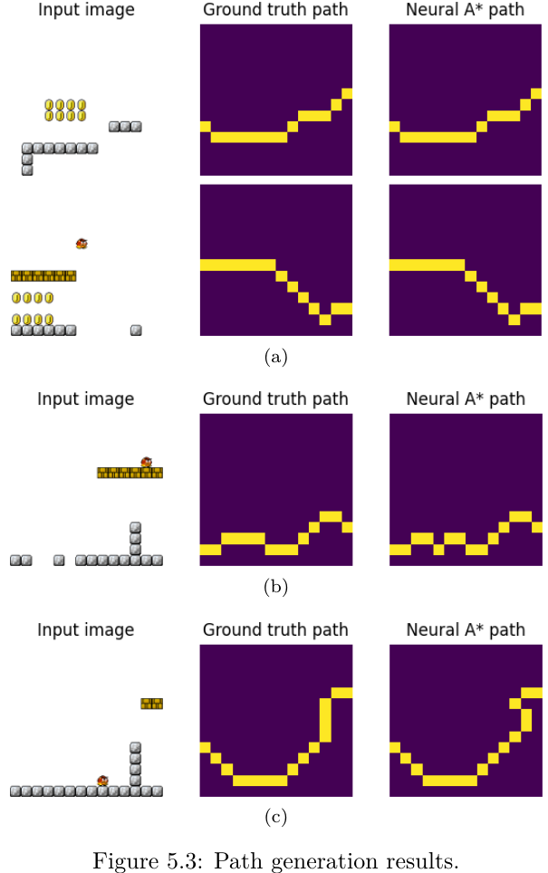

# Using Unconditional Diffusion Models in Level Generation for Super Mario Bros.
This is the code repository for the following paper, generating Super Mario Bros. levels using the unconditional diffusion model.

H. J. Lee and E. Simo-Serra, "Using Unconditional Diffusion Models in Level Generation for Super Mario Bros," 2023 18th International Conference on Machine Vision and Applications (MVA), Hamamatsu, Japan, 2023, pp. 1-5, doi: 10.23919/MVA57639.2023.10215856.

## Abstract
This study introduces a novel methodology for generating levels in the iconic video game Super Mario Bros. using a diffusion model based on a UNet architecture. The model is trained on existing levels, represented as a categorical distribution, to accurately capture the game’s fundamental mechanics and design principles. The proposed approach demonstrates notable success in producing high-quality and diverse levels, with a significant proportion being playable by an artificial agent. This research emphasizes the potential of diffusion models as an efficient tool for procedural content generation and highlights their potential impact on the development of new video games and the enhancement of existing games through generated content.

## Neural A*
The [Neural A*](https://github.com/omron-sinicx/neural-astar.git) training codes were added to generate potential paths for levels. At this stage, Neural A* is not implemented as part of the diffusion model but remains a potential enhancement that would remove the level validity check process.

